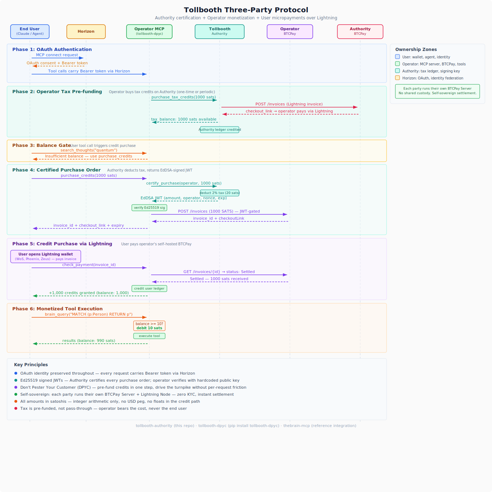

# Tollbooth Authority

**The institution that built the infrastructure.**

> *The metaphors in this project are drawn with admiration from* The Phantom Tollbooth *by Norton Juster, illustrated by Jules Feiffer (1961). Milo, Tock, the Tollbooth, Dictionopolis, and Digitopolis are creations of Mr. Juster's extraordinary imagination. We just built the payment infrastructure.*

---

## The Turnpike Authority

Every turnpike has an authority. Not the operators who run the booths, and not the drivers who pay the fares — but the institution that poured the concrete, erected the signs, and stamped the purchase orders.

The Tollbooth Authority is the Massachusetts Turnpike Authority of the Lightning economy. It doesn't operate any toll booths. It doesn't touch operator BTCPay stores. It never sees user payment data. What it does is simpler and more essential:

- It **registers operators** who want to run toll booths on the turnpike.
- It **collects a modest tax** — 2% of every fare, minimum 10 sats — paid in advance via Lightning.
- It **stamps purchase orders** — EdDSA-signed JWT certificates that prove an operator has paid their tax before collecting a fare.
- It **never touches the fare itself**. The operator collects from the user directly.

The Authority's signature is the proof that the turnpike is legitimate. Without the stamp, the toll booth doesn't open.

## How It Works

1. **Register.** An operator connects to the Authority via [Horizon MCP](https://www.fastmcp.cloud/) and calls `register_operator`. The Authority creates a ledger entry — the operator now exists on the turnpike.

2. **Fund.** The operator calls `purchase_tax_credits` with the number of sats they want to pre-fund. The Authority returns a Lightning invoice from its own BTCPay Server. The operator pays. After settlement, `check_tax_payment` credits the balance.

3. **Certify.** When a user wants to buy credits from an operator, the operator's server calls `certify_purchase`. The Authority deducts the 2% tax, signs an EdDSA JWT certificate, and returns it. This is the stamp on the purchase order.

4. **Verify.** The operator's [tollbooth-dpyc](https://github.com/lonniev/tollbooth-dpyc) library verifies the JWT using the Authority's hardcoded public key. Only if the stamp is valid does the operator create a Lightning invoice for the user. No stamp, no fare.

## Architecture

The Tollbooth ecosystem is a three-party protocol spanning three repositories:

| Repo | Role |
|------|------|
| **tollbooth-authority** (this repo) | The institution — tax collection, EdDSA signing, purchase order certification |
| [tollbooth-dpyc](https://github.com/lonniev/tollbooth-dpyc) | The booth — operator-side credit ledger, BTCPay client, tool gating |
| [thebrain-mcp](https://github.com/lonniev/thebrain-mcp) | The first city — reference MCP server powered by Tollbooth |



## Getting Started

### Connecting via Horizon MCP

The Authority runs on [FastMCP Cloud](https://www.fastmcp.cloud/). Any MCP client (Claude Desktop, Cursor, your own agent) can connect via Horizon:

```
https://www.fastmcp.cloud/server/lonniev/tollbooth-authority
```

Authentication is automatic — Horizon OAuth identifies you as an operator. No API keys to manage.

### First Connection Walkthrough

Once connected, walk through the bootstrap in order:

1. **`register_operator`** — Creates your ledger entry. You'll get back your operator ID and a zero balance.
2. **`purchase_tax_credits(amount_sats=1000)`** — Returns a Lightning invoice. Pay it with any Lightning wallet.
3. **`check_tax_payment(invoice_id="...")`** — Pass the invoice ID from step 2. Confirms settlement and credits your balance.
4. **`tax_balance`** — Verify your balance is funded.
5. **`operator_status`** — See your registration, balance, and the Authority's public key (you'll hardcode this in your tollbooth-dpyc integration).

You're now ready to certify purchase orders. When your MCP server needs to gate a user credit purchase, it calls `certify_purchase` with the operator ID and amount.

### Self-Hosting

To run your own Authority instance, set these environment variables:

| Variable | Purpose | Example |
|----------|---------|---------|
| `AUTHORITY_SIGNING_KEY` | Base64-encoded Ed25519 private key for signing JWTs | Output of `scripts/generate_keypair.py` |
| `BTCPAY_HOST` | Authority's BTCPay Server URL for tax collection | `https://btcpay.example.com` |
| `BTCPAY_STORE_ID` | BTCPay store ID for the Authority's tax store | `AbCdEfGh1234` |
| `BTCPAY_API_KEY` | BTCPay API key with invoice + payout permissions | `your-btcpay-api-key` |
| `THEBRAIN_API_KEY` | TheBrain API key for operator ledger persistence | `your-thebrain-key` |
| `THEBRAIN_VAULT_BRAIN_ID` | Brain ID used as the operator credential vault | `uuid-of-vault-brain` |
| `THEBRAIN_VAULT_HOME_ID` | Home thought ID in the vault brain | `uuid-of-home-thought` |
| `TAX_RATE_PERCENT` | Tax rate as a percentage of each certified purchase | `2.0` (default) |
| `TAX_MIN_SATS` | Minimum tax per certification in satoshis | `10` (default) |
| `CERTIFICATE_TTL_SECONDS` | How long a signed certificate remains valid | `600` (default, 10 minutes) |

## MCP Tools

| Tool | Purpose |
|------|---------|
| `register_operator` | Register as an operator on the turnpike. Creates your ledger entry so you can fund and certify. |
| `purchase_tax_credits` | Create a Lightning invoice to pre-fund your tax balance with the Authority. |
| `check_tax_payment` | Verify that a Lightning invoice has settled and credit the payment to your tax balance. |
| `tax_balance` | Check your current tax balance, total deposited, total consumed, and pending invoices. |
| `operator_status` | View your registration status, balance summary, and the Authority's Ed25519 public key. |
| `certify_purchase` | The core machine-to-machine tool. Deducts tax and returns an EdDSA-signed JWT certificate. |
| `refresh_config` | Hot-reload environment variables without redeploying the service. |

## Development

```bash
python -m venv venv
source venv/bin/activate
pip install -e ".[dev]"
pytest tests/ -q
```

## Key Generation

```bash
python scripts/generate_keypair.py
```

Outputs the base64-encoded private key (for `AUTHORITY_SIGNING_KEY` env var) and the PEM public key (for hardcoding in tollbooth-dpyc).

## Further Reading

[The Phantom Tollbooth on the Lightning Turnpike](https://stablecoin.myshopify.com/blogs/our-value/the-phantom-tollbooth-on-the-lightning-turnpike) — the full story of how we're monetizing the monetization of AI APIs, and then fading to the background.

## License

MIT

---

*Because every turnpike needs an authority. Not to control the road — just to make sure the stamps are real and the fares are fair.*
